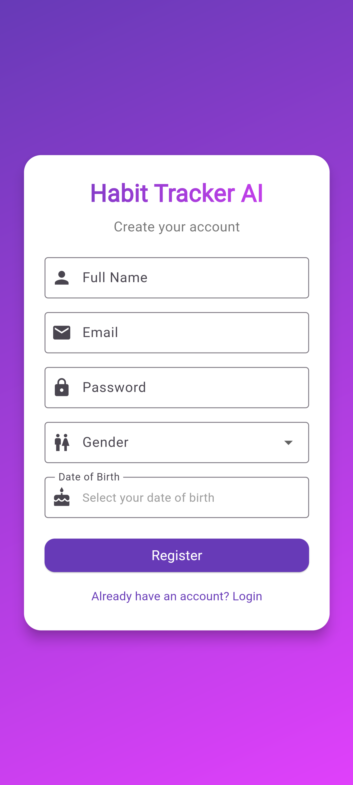

# Habit Tracker AI

**Habit Tracker AI** is a Flutter & Firebase-based mobile application that helps users **create, track, and manage daily habits**. The app provides **AI-powered habit suggestions** to help users achieve their personal goals efficiently. It also features motivational quotes, progress tracking, and offline support.

---

## Features

### Core Features

* **User Registration & Authentication**

  * Email & Password login
  * Display Name, Gender, and optional details (DOB, Height, etc.)
  * Terms & Conditions validation
  * Data stored in Firebase Firestore

* **Profile Management**

  * View and edit profile details
  * Update gender and other optional info
  * Profile changes sync across devices instantly

* **Habit Management**

  * Create, edit, and delete habits
  * Habit properties: Title, Category, Frequency, Start Date, Notes
  * Categories: Health, Study, Fitness, Productivity, Mental Health, Others
  * Store habits under `users/{userId}/habits/{habitId}` in Firestore

* **Habit Tracking**

  * Mark daily or weekly habit completion
  * Track streaks and progress
  * Visual charts for weekly/monthly habit tracking

* **AI-Powered Habit Suggestions**

  * Personalized habit suggestions using **Cohere AI**
  * Suggestions based on user goals (fitness, study, health, etc.)

* **Motivational Quotes**

  * Fetch quotes from public API (e.g., Quotable)
  * Favorite and save quotes to Firestore
  * Randomized quotes on refresh or app launch

* **Theme & Preferences**

  * Light Mode and Dark Mode toggle
  * Preferences stored locally and synced with Firestore
  * Offline support for habits and quotes using state management

* **Offline Support**

  * Data persists locally
  * Works without an internet connection
  * Updates synced to Firebase when online

---

## Technology Stack

* **Frontend:** Flutter & Dart
* **Backend:** Firebase Firestore & Authentication
* **AI Integration:** Cohere AI
* **State Management:** Riverpod
* **Other Tools:** Shared Preferences for caching, Charts for progress visualization

---

<h2 align="center">📸 Screenshots</h2>
<p align="center">
  A quick tour of the Habit Tracker AI app.
</p>

<!-- Authentication -->
<h3>Authentication</h3>
<table>
  <tr>
    <td align="center">
      <br>
      <sub><b>Login</b></sub>
    </td>
    <td align="center">
      <br>
      <sub><b>Registration</b></sub>
    </td>
  </tr>
</table>

<!-- Profile & Navigation -->
<h3>User Profile & Navigation</h3>
<table>
  <tr>
    <td align="center">
      <br>
      <sub><b>Profile</b></sub>
    </td>
    <td align="center">
      <br>
      <sub><b>Drawer</b></sub>
    </td>
  </tr>
</table>

<!-- Habits -->
<h3>Habit Management</h3>
<table>
  <tr>
    <td align="center">
      <br>
      <sub><b>Habit List</b></sub>
    </td>
    <td align="center">
      <br>
      <sub><b>Today’s Habits</b></sub>
    </td>
  </tr>
  <tr>
    <td align="center">
      <br>
      <sub><b>Add Habit</b></sub>
    </td>
    <td align="center">
      <br>
      <sub><b>Edit Habit</b></sub>
    </td>
  </tr>
  <tr>
    <td align="center">
      <br>
      <sub><b>Goals Selection</b></sub>
    </td>
    <td align="center">
      <br>
      <sub><b>AI Suggestions</b></sub>
    </td>
  </tr>
</table>

<!-- Motivation & Progress -->
<h3>Motivation & Progress</h3>
<table>
  <tr>
    <td align="center">
      <br>
      <sub><b>Motivational Quotes</b></sub>
    </td>
    <td align="center">
      <br>
      <sub><b>Progress Charts</b></sub>
    </td>
  </tr>
</table>


---

## Getting Started

### Prerequisites

* Flutter SDK installed
* Firebase project setup
* Cohere AI API Key (for habit suggestions)
* Android Studio / VSCode (recommended)

### Installation

1. Clone the repository:

```bash
git clone https://github.com/yourusername/habit-tracker-ai.git
cd habit-tracker-ai
```

2. Install dependencies:

```bash
flutter pub get
```

3. Configure Firebase:

* Replace `firebase_options.dart` with your Firebase project configuration.
* Ensure `google-services.json` (Android) and `GoogleService-Info.plist` (iOS) are in the correct folders.

4. Add Cohere API key:

* Replace your key in `cohere_service.dart`.

5. Run the app:

```bash
flutter run
```

---

## Usage

* Sign up or log in with email & password.
* Set your **personal goals** (fitness, study, etc.).
* Create habits and mark them as completed.
* Get **AI-powered habit suggestions** based on your goals.
* Browse motivational quotes and save your favorites.
* Monitor your streaks and track progress over time.
* Switch between **light & dark themes**.

---

## Contribution

Feel free to **fork the repository** and submit **pull requests** for new features, bug fixes, or improvements.

---

## License

This project is **open-source**. You can use, modify, and distribute it under the **MIT License**.

---

## Contact

For questions or suggestions, contact:
**Rajon Talukdar** – [rajontalukdar111@gmail.com](mailto:rajontalukdar111@gmail.com)

---
